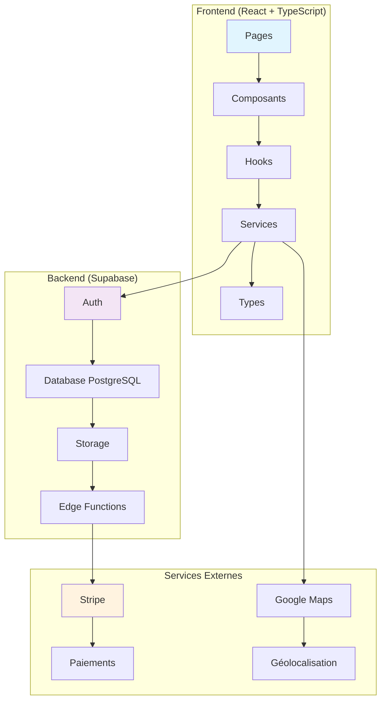
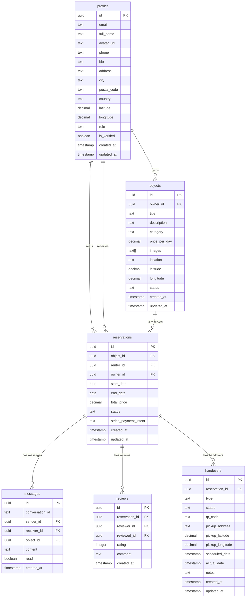
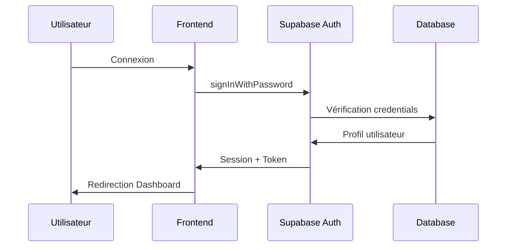
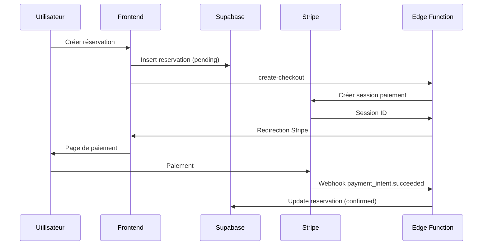
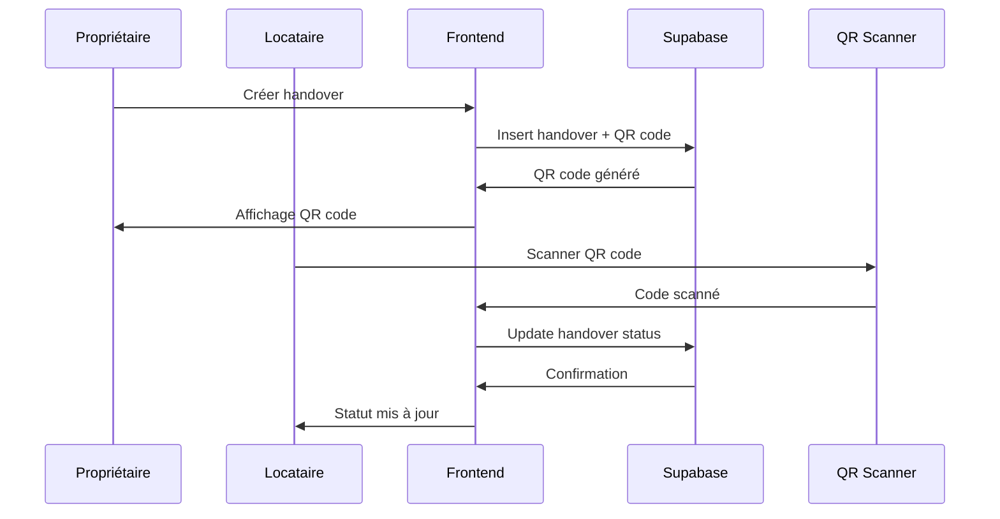

# 🏗️ Architecture NeuroLoc

## Vue d'Ensemble

NeuroLoc est une application web moderne construite avec une architecture full-stack utilisant React pour le frontend et Supabase comme Backend-as-a-Service. L'application suit les principes d'architecture moderne avec une séparation claire des responsabilités.

## 🎯 Architecture Générale



## 🎨 Frontend Architecture

### Structure des Composants

```
src/
├── components/
│   ├── common/           # Composants réutilisables
│   │   ├── Button.tsx    # Bouton avec variants
│   │   ├── Input.tsx     # Champ de saisie
│   │   ├── Card.tsx      # Conteneur de carte
│   │   ├── Badge.tsx     # Badge de statut
│   │   ├── Avatar.tsx    # Avatar utilisateur
│   │   └── Loader.tsx    # Indicateur de chargement
│   ├── layout/           # Composants de mise en page
│   │   ├── Navbar.tsx    # Barre de navigation
│   │   └── Footer.tsx    # Pied de page
│   ├── objects/          # Composants liés aux objets
│   │   ├── ObjectCard.tsx    # Carte d'objet
│   │   ├── ObjectForm.tsx    # Formulaire d'objet
│   │   └── ImageUpload.tsx   # Upload d'images
│   ├── profile/          # Composants de profil
│   │   ├── ProfileCard.tsx   # Carte de profil
│   │   ├── RoleStats.tsx     # Statistiques de rôle
│   │   └── ReviewsList.tsx   # Liste d'avis
│   ├── chat/             # Composants de messagerie
│   │   └── ChatBox.tsx   # Boîte de chat
│   ├── handovers/        # Composants de remise
│   │   ├── HandoverCard.tsx      # Carte de remise
│   │   ├── QRCodeDisplay.tsx     # Affichage QR code
│   │   └── QRCodeScanner.tsx     # Scanner QR code
│   └── payment/          # Composants de paiement
│       └── PaymentStatus.tsx # Statut de paiement
├── pages/                # Pages de l'application
├── hooks/                # Hooks personnalisés
├── services/             # Services API
├── types/                # Définitions TypeScript
└── utils/                # Utilitaires
```

### Patterns Architecturaux

#### 1. **Composants Fonctionnels avec Hooks**
```typescript
// Exemple de composant moderne
export const ObjectCard: React.FC<ObjectCardProps> = ({ object }) => {
  const { user } = useAuth();
  const [isLoading, setIsLoading] = useState(false);
  
  const handleReserve = useCallback(async () => {
    // Logique de réservation
  }, [object.id]);
  
  return (
    <Card className="card-hover">
      {/* Contenu du composant */}
    </Card>
  );
};
```

#### 2. **Hooks Personnalisés pour la Logique Métier**
```typescript
// Exemple de hook personnalisé
export const useObjects = () => {
  const [objects, setObjects] = useState<RentalObject[]>([]);
  const [loading, setLoading] = useState(true);
  
  const fetchObjects = useCallback(async () => {
    // Logique de récupération des objets
  }, []);
  
  return { objects, loading, fetchObjects };
};
```

#### 3. **Services pour les Appels API**
```typescript
// Exemple de service
export const objectsService = {
  async getObjects(): Promise<RentalObject[]> {
    const { data, error } = await supabase
      .from('objects')
      .select('*, owner:profiles(*)');
    
    if (error) throw error;
    return data || [];
  }
};
```

## 🗄️ Backend Architecture (Supabase)

### Base de Données PostgreSQL

#### Tables Principales



### Sécurité (Row Level Security)

```sql
-- Exemple de politique RLS
CREATE POLICY "Users can view their own profile" ON profiles
FOR SELECT USING (auth.uid() = id);

CREATE POLICY "Users can update their own profile" ON profiles
FOR UPDATE USING (auth.uid() = id);
```

### Storage (Images)

- **Bucket** : `object-images`
- **Politique** : Upload autorisé pour utilisateurs authentifiés
- **Format** : Images optimisées et compressées

## ⚡ Edge Functions (Deno)

### Fonctions Disponibles

#### 1. **create-checkout**
```typescript
// Création d'une session de paiement Stripe
export default async function handler(req: Request) {
  const { reservation_id, amount } = await req.json();
  
  const session = await stripe.checkout.sessions.create({
    // Configuration Stripe
  });
  
  return new Response(JSON.stringify({ sessionId: session.id }));
}
```

#### 2. **stripe-webhook**
```typescript
// Gestion des webhooks Stripe
export default async function handler(req: Request) {
  const sig = req.headers.get('stripe-signature');
  const event = stripe.webhooks.constructEvent(body, sig, webhookSecret);
  
  switch (event.type) {
    case 'payment_intent.succeeded':
      // Mise à jour du statut de réservation
      break;
  }
}
```

## 🔄 Flux de Données

### 1. **Authentification**


### 2. **Création de Réservation**


### 3. **Système de Remise QR Code**


## 🎨 Design System

### Palette de Couleurs
```css
/* Couleurs principales */
--brand-50: #eff6ff;
--brand-500: #3b82f6;
--brand-900: #1e3a8a;

--neutral-50: #f9fafb;
--neutral-500: #6b7280;
--neutral-900: #111827;

--success-500: #10b981;
--accent-500: #ef4444;
```

### Composants de Base
- **Button** : Variants (primary, secondary, ghost, danger)
- **Input** : Avec validation et icônes
- **Card** : Conteneur avec ombres et bordures
- **Badge** : Indicateurs de statut
- **Avatar** : Images de profil avec fallback

## 🔧 Configuration et Déploiement

### Variables d'Environnement
```env
# Supabase
VITE_SUPABASE_URL=https://xxx.supabase.co
VITE_SUPABASE_ANON_KEY=eyJ...

# Stripe
VITE_STRIPE_PUBLISHABLE_KEY=pk_test_...
STRIPE_SECRET_KEY=sk_test_...

# Optionnel
VITE_GOOGLE_MAPS_API_KEY=AIza...
```

### Build et Déploiement
```bash
# Build de production
npm run build

# Déploiement Vercel/Netlify
# Les fichiers dans dist/ sont prêts pour le déploiement
```

## 📊 Monitoring et Performance

### Métriques Clés
- **Temps de chargement** : < 2s pour les pages principales
- **Taille du bundle** : Optimisé avec Vite
- **Accessibilité** : WCAG 2.1 AA
- **SEO** : Meta tags et structure sémantique

### Outils de Monitoring
- **Supabase Dashboard** : Monitoring de la DB et des Edge Functions
- **Stripe Dashboard** : Suivi des paiements
- **Vercel Analytics** : Métriques de performance (si déployé sur Vercel)

---

Cette architecture garantit une application scalable, maintenable et performante, prête pour la croissance future de NeuroLoc.