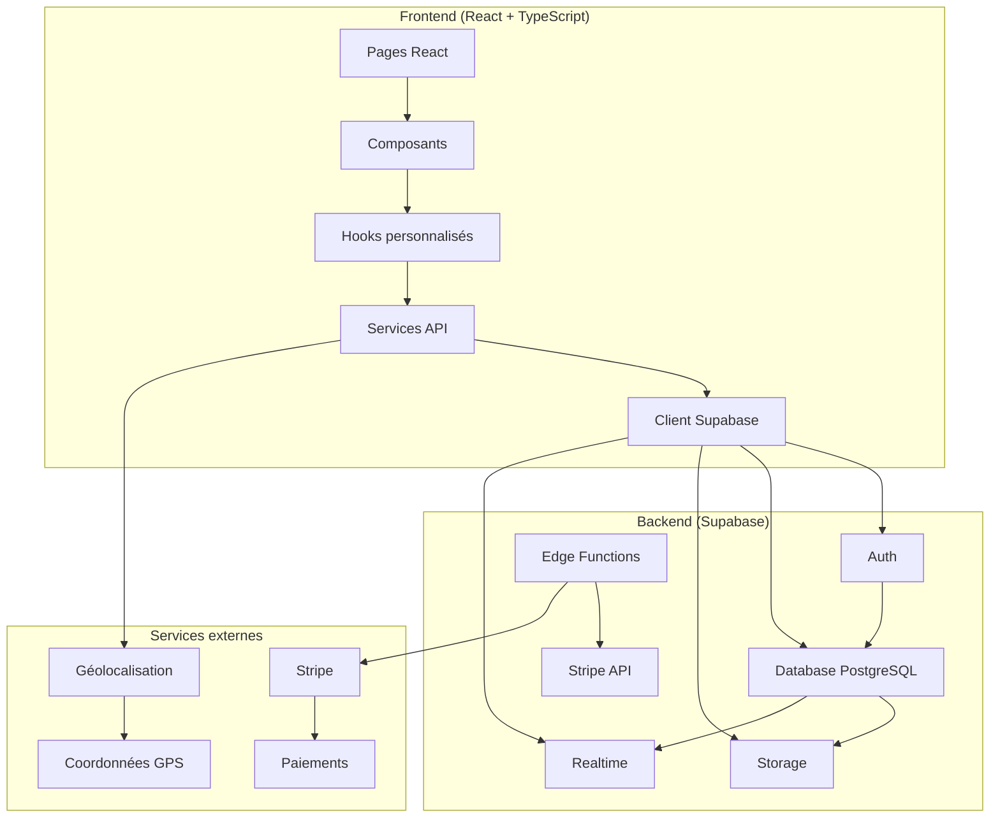
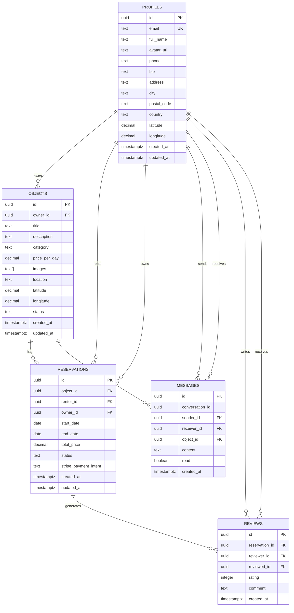

# Architecture NeuroLoc

## Vue d'ensemble

NeuroLoc suit une architecture moderne de type **JAMstack** (JavaScript, APIs, Markup) avec une séparation claire entre le frontend et le backend. L'application utilise Supabase comme Backend-as-a-Service, ce qui simplifie considérablement l'infrastructure tout en offrant des performances et une sécurité de niveau entreprise.

## Diagramme d'architecture



## Architecture Frontend

### Structure des composants

```
src/
├── components/           # Composants réutilisables
│   ├── common/          # Composants de base (Button, Input, Loader)
│   ├── layout/          # Composants de mise en page (Navbar, Footer)
│   ├── objects/         # Composants spécifiques aux objets
│   ├── profile/         # Composants de profil utilisateur
│   └── chat/            # Composants de messagerie
├── pages/               # Pages principales de l'application
├── hooks/               # Hooks React personnalisés
├── services/            # Couche d'abstraction pour les APIs
├── types/               # Définitions TypeScript
└── utils/               # Fonctions utilitaires
```

### Patterns architecturaux

#### 1. **Composition de composants**
- Composants fonctionnels avec hooks
- Séparation des responsabilités (UI vs logique métier)
- Props typées avec TypeScript

#### 2. **Gestion d'état**
- État local avec `useState` et `useReducer`
- État global via hooks personnalisés (`useAuth`, `useObjects`)
- Synchronisation temps réel avec Supabase Realtime

#### 3. **Services layer**
- Abstraction des appels API dans des services dédiés
- Gestion centralisée des erreurs
- Types TypeScript pour toutes les interfaces

#### 4. **Routing**
- React Router v6 avec routes protégées
- Lazy loading des composants
- Navigation programmatique

## Architecture Backend

### Supabase comme Backend-as-a-Service

#### 1. **Authentification**
- Supabase Auth avec JWT
- Gestion automatique des sessions
- Row Level Security (RLS) pour la sécurité

#### 2. **Base de données PostgreSQL**
- Schéma relationnel optimisé
- Fonctions SQL personnalisées
- Triggers pour l'automatisation
- Index pour les performances

#### 3. **Storage**
- Buckets organisés (`profiles`, `objects`)
- Upload sécurisé avec validation
- URLs publiques pour les images

#### 4. **Realtime**
- WebSockets pour la messagerie
- Subscriptions aux changements de données
- Notifications en temps réel

#### 5. **Edge Functions**
- Serverless functions en Deno
- Intégration Stripe
- Webhooks de paiement

## Base de données

### Schéma relationnel



### Fonctionnalités avancées

#### 1. **Géolocalisation**
- Fonctions SQL pour calculer les distances
- Index géographiques pour les requêtes spatiales
- Validation des coordonnées GPS

#### 2. **Sécurité**
- Row Level Security sur toutes les tables
- Policies granulaires par utilisateur
- Validation des données côté serveur

#### 3. **Performance**
- Index optimisés pour les requêtes fréquentes
- Triggers pour la mise à jour automatique
- Fonctions SQL réutilisables

## Intégrations externes

### Stripe
- **Checkout Sessions** pour les paiements
- **Webhooks** pour la confirmation des paiements
- **Métadonnées** pour lier les paiements aux réservations

### Géolocalisation
- **API de géocodage** pour convertir les adresses en coordonnées
- **Calcul de distances** pour la recherche proximité
- **Validation des coordonnées** GPS

## Sécurité

### Frontend
- Validation des formulaires côté client
- Sanitisation des entrées utilisateur
- Gestion sécurisée des tokens d'authentification

### Backend
- Row Level Security (RLS) sur toutes les tables
- Policies restrictives basées sur l'utilisateur
- Validation des données côté serveur
- Upload sécurisé des fichiers

### Paiements
- Aucune donnée bancaire stockée
- Tokens Stripe pour les paiements
- Webhooks pour la confirmation
- Chiffrement des communications

## Performance

### Frontend
- **Code splitting** avec React.lazy
- **Memoization** avec useMemo et useCallback
- **Optimistic updates** pour l'UX
- **Lazy loading** des images

### Backend
- **Index de base de données** optimisés
- **Pagination** pour les grandes listes
- **Cache** des requêtes fréquentes
- **CDN** pour les images via Supabase Storage

## Monitoring et logs

### Frontend
- Gestion des erreurs avec try/catch
- Logs de débogage en développement
- Toast notifications pour le feedback utilisateur

### Backend
- Logs automatiques Supabase
- Monitoring des Edge Functions
- Alertes Stripe pour les paiements

## Évolutivité

### Horizontal
- Supabase gère automatiquement la montée en charge
- Edge Functions serverless
- CDN global pour les assets

### Vertical
- Optimisation des requêtes SQL
- Cache intelligent
- Compression des données

## Déploiement

### Frontend
- Build statique optimisé
- Déploiement sur Vercel/Netlify
- Variables d'environnement sécurisées

### Backend
- Infrastructure gérée par Supabase
- Migrations automatiques
- Rollback en cas de problème

Cette architecture garantit une application performante, sécurisée et évolutive, tout en maintenant une complexité de développement raisonnable grâce à l'utilisation de Supabase comme Backend-as-a-Service.
