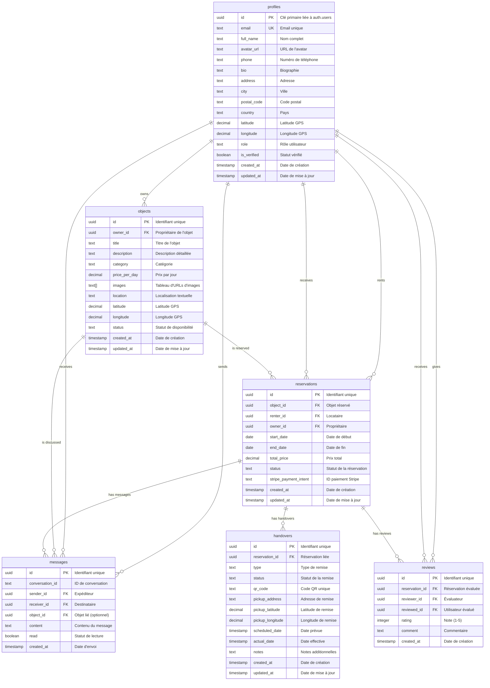

# 🗄️ Schéma de Base de Données NeuroLoc

## Vue d'Ensemble

NeuroLoc utilise PostgreSQL via Supabase pour stocker toutes les données de l'application. Ce document décrit la structure complète de la base de données, les relations entre les tables et les politiques de sécurité.

## 📊 Diagramme ERD



## 📋 Description Détaillée des Tables

### 👤 Table `profiles`

**Description** : Stocke les informations détaillées des utilisateurs authentifiés.

| Champ | Type | Contraintes | Description |
|-------|------|-------------|-------------|
| `id` | `uuid` | PK, FK vers `auth.users` | Identifiant unique lié à l'authentification |
| `email` | `text` | UNIQUE, NOT NULL | Adresse email de l'utilisateur |
| `full_name` | `text` | NULL | Nom complet affiché |
| `avatar_url` | `text` | NULL | URL de l'image de profil |
| `phone` | `text` | NULL | Numéro de téléphone |
| `bio` | `text` | NULL | Biographie de l'utilisateur |
| `address` | `text` | NULL | Adresse complète |
| `city` | `text` | NULL | Ville |
| `postal_code` | `text` | NULL | Code postal |
| `country` | `text` | NULL | Pays |
| `latitude` | `decimal(10,8)` | NULL | Coordonnée GPS latitude |
| `longitude` | `decimal(11,8)` | NULL | Coordonnée GPS longitude |
| `role` | `text` | CHECK | Rôle : 'client', 'loueur', 'admin' |
| `is_verified` | `boolean` | DEFAULT false | Statut de vérification |
| `created_at` | `timestamptz` | DEFAULT now() | Date de création |
| `updated_at` | `timestamptz` | DEFAULT now() | Date de mise à jour |

**Index** :
- `idx_profiles_email` sur `email`
- `idx_profiles_role` sur `role`
- `idx_profiles_location` sur `(latitude, longitude)`

### 📦 Table `objects`

**Description** : Contient tous les objets disponibles à la location.

| Champ | Type | Contraintes | Description |
|-------|------|-------------|-------------|
| `id` | `uuid` | PK, DEFAULT uuid_generate_v4() | Identifiant unique |
| `owner_id` | `uuid` | FK vers `profiles`, NOT NULL | Propriétaire de l'objet |
| `title` | `text` | NOT NULL | Titre de l'objet |
| `description` | `text` | NOT NULL | Description détaillée |
| `category` | `text` | NOT NULL | Catégorie de l'objet |
| `price_per_day` | `decimal(10,2)` | NOT NULL, CHECK >= 0 | Prix par jour |
| `images` | `text[]` | DEFAULT ARRAY[] | URLs des images |
| `location` | `text` | NOT NULL | Localisation textuelle |
| `latitude` | `decimal(10,8)` | NULL | Coordonnée GPS latitude |
| `longitude` | `decimal(11,8)` | NULL | Coordonnée GPS longitude |
| `status` | `text` | DEFAULT 'available', CHECK | Statut : 'available', 'rented', 'unavailable' |
| `created_at` | `timestamptz` | DEFAULT now() | Date de création |
| `updated_at` | `timestamptz` | DEFAULT now() | Date de mise à jour |

**Index** :
- `idx_objects_owner` sur `owner_id`
- `idx_objects_category` sur `category`
- `idx_objects_status` sur `status`
- `idx_objects_location` sur `(latitude, longitude)`
- `idx_objects_price` sur `price_per_day`

### 📅 Table `reservations`

**Description** : Gère les réservations d'objets entre utilisateurs.

| Champ | Type | Contraintes | Description |
|-------|------|-------------|-------------|
| `id` | `uuid` | PK, DEFAULT uuid_generate_v4() | Identifiant unique |
| `object_id` | `uuid` | FK vers `objects`, NOT NULL | Objet réservé |
| `renter_id` | `uuid` | FK vers `profiles`, NOT NULL | Locataire |
| `owner_id` | `uuid` | FK vers `profiles`, NOT NULL | Propriétaire |
| `start_date` | `date` | NOT NULL | Date de début de location |
| `end_date` | `date` | NOT NULL | Date de fin de location |
| `total_price` | `decimal(10,2)` | NOT NULL, CHECK >= 0 | Prix total calculé |
| `status` | `text` | DEFAULT 'pending', CHECK | Statut de la réservation |
| `stripe_payment_intent` | `text` | NULL | ID du paiement Stripe |
| `created_at` | `timestamptz` | DEFAULT now() | Date de création |
| `updated_at` | `timestamptz` | DEFAULT now() | Date de mise à jour |

**Statuts possibles** :
- `pending` : En attente de confirmation
- `confirmed` : Confirmée et payée
- `ongoing` : En cours de location
- `completed` : Terminée avec succès
- `cancelled` : Annulée
- `rejected` : Refusée par le propriétaire

**Index** :
- `idx_reservations_object` sur `object_id`
- `idx_reservations_renter` sur `renter_id`
- `idx_reservations_owner` sur `owner_id`
- `idx_reservations_dates` sur `(start_date, end_date)`
- `idx_reservations_status` sur `status`

### 💬 Table `messages`

**Description** : Stocke les messages de la messagerie intégrée.

| Champ | Type | Contraintes | Description |
|-------|------|-------------|-------------|
| `id` | `uuid` | PK, DEFAULT uuid_generate_v4() | Identifiant unique |
| `conversation_id` | `text` | NOT NULL | ID de conversation |
| `sender_id` | `uuid` | FK vers `profiles`, NOT NULL | Expéditeur |
| `receiver_id` | `uuid` | FK vers `profiles`, NOT NULL | Destinataire |
| `object_id` | `uuid` | FK vers `objects`, NULL | Objet lié (optionnel) |
| `content` | `text` | NOT NULL | Contenu du message |
| `read` | `boolean` | DEFAULT false | Statut de lecture |
| `created_at` | `timestamptz` | DEFAULT now() | Date d'envoi |

**Index** :
- `idx_messages_conversation` sur `conversation_id`
- `idx_messages_sender` sur `sender_id`
- `idx_messages_receiver` sur `receiver_id`
- `idx_messages_object` sur `object_id`
- `idx_messages_created` sur `created_at DESC`

### ⭐ Table `reviews`

**Description** : Gère les avis et évaluations entre utilisateurs.

| Champ | Type | Contraintes | Description |
|-------|------|-------------|-------------|
| `id` | `uuid` | PK, DEFAULT uuid_generate_v4() | Identifiant unique |
| `reservation_id` | `uuid` | FK vers `reservations`, NOT NULL | Réservation évaluée |
| `reviewer_id` | `uuid` | FK vers `profiles`, NOT NULL | Utilisateur qui évalue |
| `reviewed_id` | `uuid` | FK vers `profiles`, NOT NULL | Utilisateur évalué |
| `rating` | `integer` | NOT NULL, CHECK (1-5) | Note de 1 à 5 étoiles |
| `comment` | `text` | NULL | Commentaire textuel |
| `created_at` | `timestamptz` | DEFAULT now() | Date de création |

**Contraintes** :
- Un utilisateur ne peut évaluer qu'une fois par réservation
- Seules les réservations terminées peuvent être évaluées

**Index** :
- `idx_reviews_reservation` sur `reservation_id`
- `idx_reviews_reviewer` sur `reviewer_id`
- `idx_reviews_reviewed` sur `reviewed_id`
- `idx_reviews_rating` sur `rating`

### 📱 Table `handovers`

**Description** : Gère les remises d'objets avec QR codes.

| Champ | Type | Contraintes | Description |
|-------|------|-------------|-------------|
| `id` | `uuid` | PK, DEFAULT uuid_generate_v4() | Identifiant unique |
| `reservation_id` | `uuid` | FK vers `reservations`, NOT NULL | Réservation liée |
| `type` | `text` | NOT NULL, CHECK | Type : 'pickup' ou 'return' |
| `status` | `text` | DEFAULT 'pending', CHECK | Statut de la remise |
| `qr_code` | `text` | NOT NULL, UNIQUE | Code QR unique |
| `pickup_address` | `text` | NOT NULL | Adresse de remise |
| `pickup_latitude` | `decimal(10,8)` | NULL | Latitude de remise |
| `pickup_longitude` | `decimal(11,8)` | NULL | Longitude de remise |
| `scheduled_date` | `timestamptz` | NOT NULL | Date prévue de remise |
| `actual_date` | `timestamptz` | NULL | Date effective de remise |
| `notes` | `text` | NULL | Notes additionnelles |
| `created_at` | `timestamptz` | DEFAULT now() | Date de création |
| `updated_at` | `timestamptz` | DEFAULT now() | Date de mise à jour |

**Statuts possibles** :
- `pending` : En attente
- `picked_up` : Récupéré
- `returned` : Rendu
- `cancelled` : Annulé

**Index** :
- `idx_handovers_reservation` sur `reservation_id`
- `idx_handovers_qr_code` sur `qr_code`
- `idx_handovers_status` sur `status`
- `idx_handovers_type` sur `type`

## 🔒 Sécurité (Row Level Security)

### Politiques RLS

#### Table `profiles`
```sql
-- Lecture : Tous les utilisateurs authentifiés peuvent voir les profils publics
CREATE POLICY "Public profiles are viewable by authenticated users" ON profiles
FOR SELECT USING (auth.role() = 'authenticated');

-- Modification : Seul le propriétaire peut modifier son profil
CREATE POLICY "Users can update their own profile" ON profiles
FOR UPDATE USING (auth.uid() = id);
```

#### Table `objects`
```sql
-- Lecture : Tous les objets disponibles sont visibles
CREATE POLICY "Available objects are viewable by authenticated users" ON objects
FOR SELECT USING (auth.role() = 'authenticated');

-- Modification : Seul le propriétaire peut modifier ses objets
CREATE POLICY "Users can update their own objects" ON objects
FOR UPDATE USING (auth.uid() = owner_id);
```

#### Table `reservations`
```sql
-- Lecture : Accès limité aux parties concernées
CREATE POLICY "Users can view their own reservations" ON reservations
FOR SELECT USING (
  auth.uid() = renter_id OR 
  auth.uid() = owner_id
);

-- Modification : Seul le propriétaire peut confirmer/refuser
CREATE POLICY "Owners can update reservation status" ON reservations
FOR UPDATE USING (auth.uid() = owner_id);
```

#### Table `messages`
```sql
-- Lecture : Accès limité aux participants de la conversation
CREATE POLICY "Users can view their own messages" ON messages
FOR SELECT USING (
  auth.uid() = sender_id OR 
  auth.uid() = receiver_id
);

-- Insertion : Seul l'expéditeur peut envoyer
CREATE POLICY "Users can send messages" ON messages
FOR INSERT WITH CHECK (auth.uid() = sender_id);
```

## 📊 Fonctions et Triggers

### Fonctions Utilitaires

#### Calcul du Prix Total
```sql
CREATE OR REPLACE FUNCTION calculate_total_price(
  p_price_per_day DECIMAL,
  p_start_date DATE,
  p_end_date DATE
) RETURNS DECIMAL AS $$
BEGIN
  RETURN p_price_per_day * (p_end_date - p_start_date + 1);
END;
$$ LANGUAGE plpgsql;
```

#### Génération de QR Code
```sql
CREATE OR REPLACE FUNCTION generate_qr_code()
RETURNS TEXT AS $$
BEGIN
  RETURN 'QR_' || encode(gen_random_bytes(16), 'hex');
END;
$$ LANGUAGE plpgsql;
```

### Triggers Automatiques

#### Mise à Jour des Timestamps
```sql
CREATE OR REPLACE FUNCTION update_updated_at_column()
RETURNS TRIGGER AS $$
BEGIN
  NEW.updated_at = now();
  RETURN NEW;
END;
$$ LANGUAGE plpgsql;

-- Application sur toutes les tables avec updated_at
CREATE TRIGGER update_profiles_updated_at 
  BEFORE UPDATE ON profiles 
  FOR EACH ROW EXECUTE FUNCTION update_updated_at_column();
```

#### Mise à Jour du Statut des Objets
```sql
CREATE OR REPLACE FUNCTION update_object_status()
RETURNS TRIGGER AS $$
BEGIN
  -- Mettre à jour le statut de l'objet selon les réservations
  IF NEW.status = 'confirmed' THEN
    UPDATE objects SET status = 'rented' WHERE id = NEW.object_id;
  ELSIF NEW.status = 'completed' THEN
    UPDATE objects SET status = 'available' WHERE id = NEW.object_id;
  END IF;
  
  RETURN NEW;
END;
$$ LANGUAGE plpgsql;

CREATE TRIGGER update_object_status_trigger
  AFTER UPDATE ON reservations
  FOR EACH ROW EXECUTE FUNCTION update_object_status();
```

## 🗂️ Storage (Supabase)

### Buckets

#### `object-images`
- **Type** : Public
- **Usage** : Stockage des images d'objets
- **Politique** : Upload autorisé pour utilisateurs authentifiés
- **Formats** : JPG, PNG, WebP
- **Taille max** : 5MB par image

#### `avatars`
- **Type** : Public
- **Usage** : Stockage des avatars utilisateurs
- **Politique** : Upload autorisé pour le propriétaire uniquement
- **Formats** : JPG, PNG
- **Taille max** : 2MB

## 📈 Performance et Optimisation

### Index Recommandés
```sql
-- Index composites pour les requêtes fréquentes
CREATE INDEX idx_objects_search ON objects 
USING GIN (to_tsvector('french', title || ' ' || description));

CREATE INDEX idx_reservations_dates_status ON reservations 
(start_date, end_date, status);

CREATE INDEX idx_messages_unread ON messages 
(receiver_id, read, created_at DESC);
```

### Requêtes Optimisées
```sql
-- Recherche d'objets avec géolocalisation
SELECT *, 
  ST_Distance(
    ST_Point(longitude, latitude),
    ST_Point($1, $2)
  ) as distance
FROM objects 
WHERE status = 'available'
  AND ST_DWithin(
    ST_Point(longitude, latitude),
    ST_Point($1, $2),
    $3
  )
ORDER BY distance;
```

## 🔄 Migrations et Évolution

### Structure des Migrations
```
supabase/migrations/
├── 001_initial_schema.sql      # Schéma initial
├── 002_storage_setup.sql       # Configuration storage
├── 003_add_geolocation.sql     # Ajout géolocalisation
├── 004_create_handovers.sql    # Table handovers
└── 005_add_user_roles.sql      # Système de rôles
```

### Bonnes Pratiques
- **Versioning** : Numérotation séquentielle des migrations
- **Rollback** : Chaque migration doit être réversible
- **Tests** : Tester les migrations sur un environnement de dev
- **Documentation** : Commenter les changements complexes

---

Ce schéma de base de données est conçu pour être scalable, sécurisé et performant, supportant la croissance future de NeuroLoc tout en maintenant la cohérence des données et la sécurité des utilisateurs.