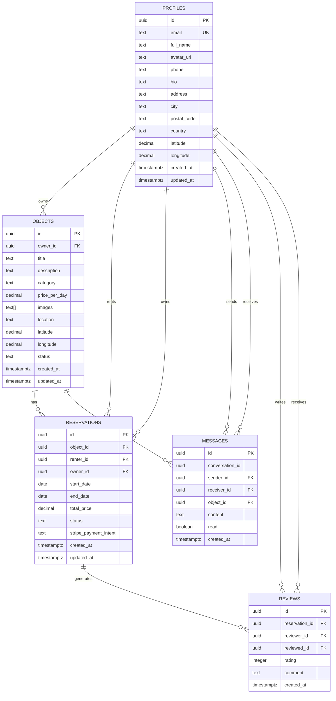

# Schéma de base de données NeuroLoc

## Vue d'ensemble

La base de données NeuroLoc utilise PostgreSQL avec Supabase et implémente un schéma relationnel optimisé pour une plateforme de location d'objets entre particuliers. Le design privilégie la sécurité, les performances et la scalabilité.

## Architecture générale

### Technologies utilisées
- **PostgreSQL 15+** : Base de données relationnelle
- **Row Level Security (RLS)** : Sécurité au niveau des lignes
- **UUID** : Identifiants uniques pour toutes les entités
- **Triggers** : Automatisation des tâches récurrentes
- **Fonctions SQL** : Logique métier côté serveur
- **Index** : Optimisation des performances

### Principes de design
- **Normalisation** : Éviter la redondance des données
- **Intégrité référentielle** : Contraintes de clés étrangères
- **Sécurité** : RLS sur toutes les tables sensibles
- **Performance** : Index stratégiques pour les requêtes fréquentes
- **Audit** : Traçabilité des modifications

## Diagramme ERD



## Tables détaillées

### 1. Table `profiles`

**Description :** Stocke les informations détaillées des utilisateurs, liée à `auth.users` de Supabase.

```sql
CREATE TABLE profiles (
  id uuid PRIMARY KEY REFERENCES auth.users(id) ON DELETE CASCADE,
  email text UNIQUE NOT NULL,
  full_name text,
  avatar_url text,
  phone text,
  bio text,
  address text,
  city text,
  postal_code text,
  country text,
  latitude decimal(10,8),
  longitude decimal(11,8),
  created_at timestamptz DEFAULT now() NOT NULL,
  updated_at timestamptz DEFAULT now() NOT NULL
);
```

**Contraintes :**
- `id` : Clé primaire liée à `auth.users`
- `email` : Unique et non null
- `latitude` : Entre -90 et 90
- `longitude` : Entre -180 et 180

**Index :**
```sql
CREATE INDEX idx_profiles_location ON profiles(latitude, longitude) 
WHERE latitude IS NOT NULL AND longitude IS NOT NULL;
CREATE INDEX idx_profiles_city ON profiles(city) WHERE city IS NOT NULL;
CREATE INDEX idx_profiles_country ON profiles(country) WHERE country IS NOT NULL;
```

### 2. Table `objects`

**Description :** Contient tous les objets disponibles à la location.

```sql
CREATE TABLE objects (
  id uuid PRIMARY KEY DEFAULT uuid_generate_v4(),
  owner_id uuid NOT NULL REFERENCES profiles(id) ON DELETE CASCADE,
  title text NOT NULL,
  description text NOT NULL,
  category text NOT NULL,
  price_per_day decimal(10,2) NOT NULL CHECK (price_per_day >= 0),
  images text[] DEFAULT ARRAY[]::text[],
  location text NOT NULL,
  latitude decimal(10,8),
  longitude decimal(11,8),
  status text NOT NULL DEFAULT 'available' 
    CHECK (status IN ('available', 'rented', 'unavailable')),
  created_at timestamptz DEFAULT now() NOT NULL,
  updated_at timestamptz DEFAULT now() NOT NULL
);
```

**Contraintes :**
- `price_per_day` : Doit être positif ou zéro
- `status` : Valeurs limitées à 'available', 'rented', 'unavailable'
- `latitude/longitude` : Coordonnées GPS valides

**Index :**
```sql
CREATE INDEX idx_objects_owner_id ON objects(owner_id);
CREATE INDEX idx_objects_status ON objects(status);
CREATE INDEX idx_objects_category ON objects(category);
CREATE INDEX idx_objects_location ON objects(location);
CREATE INDEX idx_objects_price ON objects(price_per_day);
```

### 3. Table `reservations`

**Description :** Gère les réservations d'objets avec suivi des paiements.

```sql
CREATE TABLE reservations (
  id uuid PRIMARY KEY DEFAULT uuid_generate_v4(),
  object_id uuid NOT NULL REFERENCES objects(id) ON DELETE CASCADE,
  renter_id uuid NOT NULL REFERENCES profiles(id) ON DELETE CASCADE,
  owner_id uuid NOT NULL REFERENCES profiles(id) ON DELETE CASCADE,
  start_date date NOT NULL,
  end_date date NOT NULL,
  total_price decimal(10,2) NOT NULL CHECK (total_price >= 0),
  status text NOT NULL DEFAULT 'pending' 
    CHECK (status IN ('pending', 'confirmed', 'ongoing', 'completed', 'cancelled')),
  stripe_payment_intent text,
  created_at timestamptz DEFAULT now() NOT NULL,
  updated_at timestamptz DEFAULT now() NOT NULL,
  CONSTRAINT valid_dates CHECK (end_date > start_date)
);
```

**Contraintes :**
- `total_price` : Doit être positif ou zéro
- `status` : Valeurs limitées aux statuts de réservation
- `valid_dates` : La date de fin doit être après la date de début

**Index :**
```sql
CREATE INDEX idx_reservations_object_id ON reservations(object_id);
CREATE INDEX idx_reservations_renter_id ON reservations(renter_id);
CREATE INDEX idx_reservations_owner_id ON reservations(owner_id);
CREATE INDEX idx_reservations_dates ON reservations(start_date, end_date);
CREATE INDEX idx_reservations_status ON reservations(status);
```

### 4. Table `messages`

**Description :** Système de messagerie entre utilisateurs.

```sql
CREATE TABLE messages (
  id uuid PRIMARY KEY DEFAULT uuid_generate_v4(),
  conversation_id uuid NOT NULL,
  sender_id uuid NOT NULL REFERENCES profiles(id) ON DELETE CASCADE,
  receiver_id uuid NOT NULL REFERENCES profiles(id) ON DELETE CASCADE,
  object_id uuid REFERENCES objects(id) ON DELETE SET NULL,
  content text NOT NULL,
  read boolean DEFAULT false NOT NULL,
  created_at timestamptz DEFAULT now() NOT NULL
);
```

**Contraintes :**
- `content` : Non null et non vide
- `object_id` : Optionnel, peut être null

**Index :**
```sql
CREATE INDEX idx_messages_conversation_id ON messages(conversation_id);
CREATE INDEX idx_messages_sender_id ON messages(sender_id);
CREATE INDEX idx_messages_receiver_id ON messages(receiver_id);
CREATE INDEX idx_messages_created_at ON messages(created_at);
CREATE INDEX idx_messages_read ON messages(read) WHERE read = false;
```

### 5. Table `reviews`

**Description :** Système d'avis et évaluations entre utilisateurs.

```sql
CREATE TABLE reviews (
  id uuid PRIMARY KEY DEFAULT uuid_generate_v4(),
  reservation_id uuid NOT NULL REFERENCES reservations(id) ON DELETE CASCADE,
  reviewer_id uuid NOT NULL REFERENCES profiles(id) ON DELETE CASCADE,
  reviewed_id uuid NOT NULL REFERENCES profiles(id) ON DELETE CASCADE,
  rating integer NOT NULL CHECK (rating >= 1 AND rating <= 5),
  comment text,
  created_at timestamptz DEFAULT now() NOT NULL,
  UNIQUE(reservation_id, reviewer_id)
);
```

**Contraintes :**
- `rating` : Entre 1 et 5 inclus
- `UNIQUE(reservation_id, reviewer_id)` : Un avis par réservation par utilisateur

**Index :**
```sql
CREATE INDEX idx_reviews_reviewed_id ON reviews(reviewed_id);
CREATE INDEX idx_reviews_reviewer_id ON reviews(reviewer_id);
CREATE INDEX idx_reviews_rating ON reviews(rating);
CREATE INDEX idx_reviews_created_at ON reviews(created_at);
```

## Fonctions SQL personnalisées

### 1. Fonction de calcul de distance

```sql
CREATE OR REPLACE FUNCTION calculate_distance(
  lat1 decimal(10,8),
  lon1 decimal(11,8),
  lat2 decimal(10,8),
  lon2 decimal(11,8)
)
RETURNS decimal(10,2) AS $$
DECLARE
  earth_radius decimal(10,2) := 6371; -- Rayon de la Terre en kilomètres
  dlat decimal(10,8);
  dlon decimal(11,8);
  a decimal(20,10);
  c decimal(20,10);
  distance decimal(10,2);
BEGIN
  -- Validation des coordonnées
  IF lat1 IS NULL OR lon1 IS NULL OR lat2 IS NULL OR lon2 IS NULL THEN
    RETURN NULL;
  END IF;
  
  -- Conversion en radians et calcul Haversine
  dlat := radians(lat2 - lat1);
  dlon := radians(lon2 - lon1);
  
  a := sin(dlat/2) * sin(dlat/2) + 
       cos(radians(lat1)) * cos(radians(lat2)) * 
       sin(dlon/2) * sin(dlon/2);
  
  c := 2 * atan2(sqrt(a), sqrt(1-a));
  distance := earth_radius * c;
  
  RETURN round(distance * 100) / 100;
END;
$$ LANGUAGE plpgsql IMMUTABLE;
```

### 2. Fonction de recherche géographique

```sql
CREATE OR REPLACE FUNCTION find_users_within_radius(
  center_lat decimal(10,8),
  center_lon decimal(11,8),
  radius_km decimal(10,2)
)
RETURNS TABLE(
  user_id uuid,
  full_name text,
  city text,
  country text,
  latitude decimal(10,8),
  longitude decimal(11,8),
  distance_km decimal(10,2)
) AS $$
BEGIN
  RETURN QUERY
  SELECT 
    p.id as user_id,
    p.full_name,
    p.city,
    p.country,
    p.latitude,
    p.longitude,
    calculate_distance(center_lat, center_lon, p.latitude, p.longitude) as distance_km
  FROM profiles p
  WHERE p.latitude IS NOT NULL 
    AND p.longitude IS NOT NULL
    AND calculate_distance(center_lat, center_lon, p.latitude, p.longitude) <= radius_km
  ORDER BY distance_km ASC;
END;
$$ LANGUAGE plpgsql;
```

### 3. Fonction de mise à jour automatique

```sql
CREATE OR REPLACE FUNCTION update_updated_at_column()
RETURNS TRIGGER AS $$
BEGIN
  NEW.updated_at = now();
  RETURN NEW;
END;
$$ LANGUAGE plpgsql;
```

## Triggers

### 1. Mise à jour automatique des timestamps

```sql
-- Triggers pour updated_at
CREATE TRIGGER update_profiles_updated_at 
  BEFORE UPDATE ON profiles
  FOR EACH ROW EXECUTE FUNCTION update_updated_at_column();

CREATE TRIGGER update_objects_updated_at 
  BEFORE UPDATE ON objects
  FOR EACH ROW EXECUTE FUNCTION update_updated_at_column();

CREATE TRIGGER update_reservations_updated_at 
  BEFORE UPDATE ON reservations
  FOR EACH ROW EXECUTE FUNCTION update_updated_at_column();
```

### 2. Création automatique de profil

```sql
CREATE OR REPLACE FUNCTION handle_new_user()
RETURNS TRIGGER AS $$
BEGIN
  INSERT INTO public.profiles (id, email, full_name)
  VALUES (NEW.id, NEW.email, NEW.raw_user_meta_data->>'full_name');
  RETURN NEW;
END;
$$ LANGUAGE plpgsql SECURITY DEFINER;

CREATE TRIGGER on_auth_user_created
  AFTER INSERT ON auth.users
  FOR EACH ROW EXECUTE FUNCTION handle_new_user();
```

## Row Level Security (RLS)

### Activation RLS

```sql
-- Activer RLS sur toutes les tables
ALTER TABLE profiles ENABLE ROW LEVEL SECURITY;
ALTER TABLE objects ENABLE ROW LEVEL SECURITY;
ALTER TABLE reservations ENABLE ROW LEVEL SECURITY;
ALTER TABLE messages ENABLE ROW LEVEL SECURITY;
ALTER TABLE reviews ENABLE ROW LEVEL SECURITY;
```

### Policies pour `profiles`

```sql
-- Lecture publique des profils
CREATE POLICY "Users can view all profiles"
  ON profiles FOR SELECT
  TO authenticated
  USING (true);

-- Modification de son propre profil
CREATE POLICY "Users can update own profile"
  ON profiles FOR UPDATE
  TO authenticated
  USING (auth.uid() = id)
  WITH CHECK (auth.uid() = id);
```

### Policies pour `objects`

```sql
-- Lecture publique des objets disponibles
CREATE POLICY "Anyone can view available objects"
  ON objects FOR SELECT
  TO authenticated
  USING (true);

-- Création d'objets par utilisateurs authentifiés
CREATE POLICY "Users can create objects"
  ON objects FOR INSERT
  TO authenticated
  WITH CHECK (auth.uid() = owner_id);

-- Modification de ses propres objets
CREATE POLICY "Owners can update own objects"
  ON objects FOR UPDATE
  TO authenticated
  USING (auth.uid() = owner_id)
  WITH CHECK (auth.uid() = owner_id);

-- Suppression de ses propres objets
CREATE POLICY "Owners can delete own objects"
  ON objects FOR DELETE
  TO authenticated
  USING (auth.uid() = owner_id);
```

### Policies pour `reservations`

```sql
-- Lecture des réservations par les parties concernées
CREATE POLICY "Users can view own reservations as renter"
  ON reservations FOR SELECT
  TO authenticated
  USING (auth.uid() = renter_id OR auth.uid() = owner_id);

-- Création de réservations
CREATE POLICY "Users can create reservations"
  ON reservations FOR INSERT
  TO authenticated
  WITH CHECK (auth.uid() = renter_id);

-- Modification par les parties concernées
CREATE POLICY "Renters and owners can update reservations"
  ON reservations FOR UPDATE
  TO authenticated
  USING (auth.uid() = renter_id OR auth.uid() = owner_id)
  WITH CHECK (auth.uid() = renter_id OR auth.uid() = owner_id);
```

### Policies pour `messages`

```sql
-- Lecture des messages par les participants
CREATE POLICY "Users can view messages they sent or received"
  ON messages FOR SELECT
  TO authenticated
  USING (auth.uid() = sender_id OR auth.uid() = receiver_id);

-- Envoi de messages
CREATE POLICY "Users can send messages"
  ON messages FOR INSERT
  TO authenticated
  WITH CHECK (auth.uid() = sender_id);

-- Marquage comme lu par le destinataire
CREATE POLICY "Receivers can update message read status"
  ON messages FOR UPDATE
  TO authenticated
  USING (auth.uid() = receiver_id)
  WITH CHECK (auth.uid() = receiver_id);
```

### Policies pour `reviews`

```sql
-- Lecture publique des avis
CREATE POLICY "Anyone can view reviews"
  ON reviews FOR SELECT
  TO authenticated
  USING (true);

-- Création d'avis pour ses propres réservations
CREATE POLICY "Users can create reviews for their reservations"
  ON reviews FOR INSERT
  TO authenticated
  WITH CHECK (
    auth.uid() = reviewer_id AND
    EXISTS (
      SELECT 1 FROM reservations
      WHERE reservations.id = reservation_id
      AND (reservations.renter_id = auth.uid() OR reservations.owner_id = auth.uid())
      AND reservations.status = 'completed'
    )
  );

-- Modification de ses propres avis
CREATE POLICY "Reviewers can update own reviews"
  ON reviews FOR UPDATE
  TO authenticated
  USING (auth.uid() = reviewer_id)
  WITH CHECK (auth.uid() = reviewer_id);
```

## Optimisations de performance

### Index composites

```sql
-- Index pour les requêtes de recherche d'objets
CREATE INDEX idx_objects_search ON objects(status, category, price_per_day) 
WHERE status = 'available';

-- Index pour les requêtes de réservation par dates
CREATE INDEX idx_reservations_availability ON reservations(object_id, start_date, end_date, status)
WHERE status IN ('confirmed', 'ongoing');

-- Index pour les messages non lus
CREATE INDEX idx_messages_unread ON messages(receiver_id, read, created_at)
WHERE read = false;
```

### Vues matérialisées (optionnelles)

```sql
-- Vue pour les statistiques d'objets populaires
CREATE MATERIALIZED VIEW popular_objects AS
SELECT 
  o.id,
  o.title,
  o.category,
  o.price_per_day,
  COUNT(r.id) as reservation_count,
  AVG(r.total_price) as avg_price
FROM objects o
LEFT JOIN reservations r ON o.id = r.object_id
WHERE o.status = 'available'
GROUP BY o.id, o.title, o.category, o.price_per_day
ORDER BY reservation_count DESC;

-- Refresh périodique
CREATE OR REPLACE FUNCTION refresh_popular_objects()
RETURNS void AS $$
BEGIN
  REFRESH MATERIALIZED VIEW popular_objects;
END;
$$ LANGUAGE plpgsql;
```

## Migration et maintenance

### Scripts de migration

```sql
-- Exemple de migration pour ajouter un champ
ALTER TABLE profiles ADD COLUMN IF NOT EXISTS phone_verified boolean DEFAULT false;

-- Migration pour ajouter un index
CREATE INDEX IF NOT EXISTS idx_profiles_phone_verified ON profiles(phone_verified)
WHERE phone_verified = true;
```

### Maintenance des données

```sql
-- Nettoyage des messages anciens (optionnel)
DELETE FROM messages 
WHERE created_at < now() - interval '1 year'
AND read = true;

-- Archivage des réservations terminées (optionnel)
CREATE TABLE reservations_archive (LIKE reservations INCLUDING ALL);
INSERT INTO reservations_archive 
SELECT * FROM reservations 
WHERE status = 'completed' 
AND created_at < now() - interval '6 months';
```

## Monitoring et surveillance

### Requêtes de monitoring

```sql
-- Statistiques générales
SELECT 
  (SELECT COUNT(*) FROM profiles) as total_users,
  (SELECT COUNT(*) FROM objects WHERE status = 'available') as available_objects,
  (SELECT COUNT(*) FROM reservations WHERE status = 'confirmed') as active_reservations,
  (SELECT COUNT(*) FROM messages WHERE read = false) as unread_messages;

-- Performance des requêtes
SELECT 
  schemaname,
  tablename,
  attname,
  n_distinct,
  correlation
FROM pg_stats 
WHERE schemaname = 'public'
ORDER BY n_distinct DESC;
```

Ce schéma de base de données est conçu pour être évolutif, sécurisé et performant, tout en maintenant la simplicité de maintenance et de développement.
